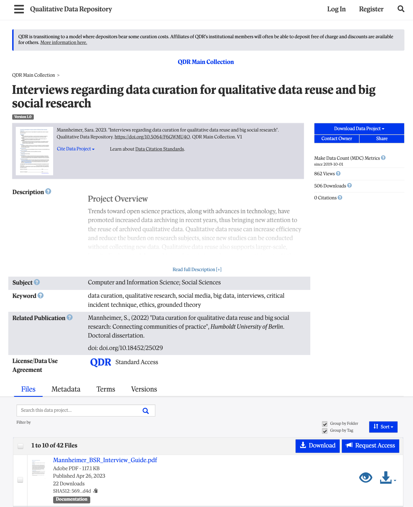
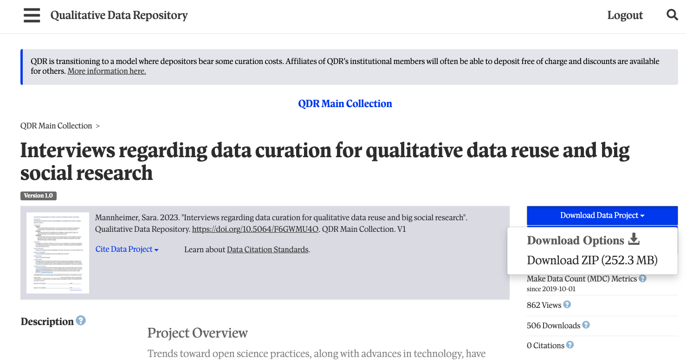
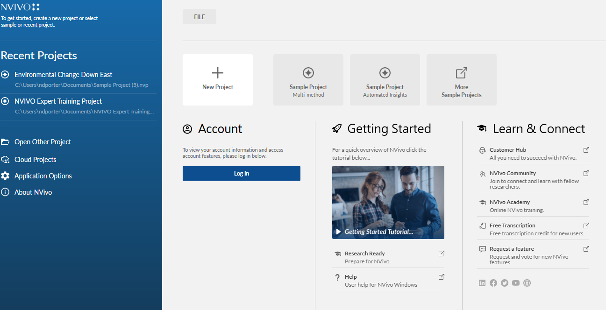
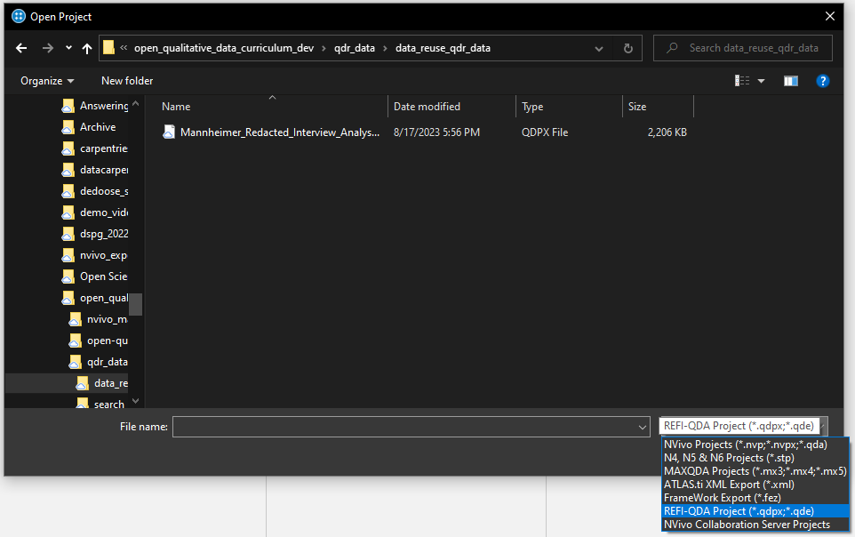
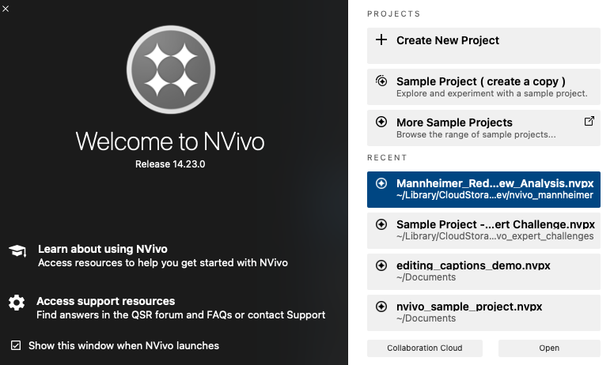

::: questions
-   Why reuse qualitative data?
-   Why share qualitative data?
:::

::: objectives
-   Appreciate the goals and approach of this lesson
-   Identify opportunities and barriers for qualitative data reuse and sharing
-   Practice finding and downloading data from a qualitative data repository
:::

For decades, a movement has been building among quantitative researchers to share data and analysis as completely as possible. In part, this is meant to improve scientific transparency, so findings can be checked and verified, but it also serves to provide a basis for future studies.

Qualitative researchers have been much slower to adopt data and analysis sharing, for a few different reasons, including both technical and normative constraints. On the technical side, qualitative data has had limited standards, and analysis has often been conducted manually or with specialized software with limited compatibility with other software. More importantly, however, qualitative researchers tend to emphasize the role of both the context of data collection and the perspective of the researcher in the research process - in contrast to quantitative methods that often seek precisely to minimize the subjectivity of their methods and draw wide-ranging conclusions about entire populations.

Moreover, qualitative data often presents challenges for protecting privacy when sharing data, because interviews, focus groups, and other qualitative methods provide rich detail that can make it easier to identify participants even if direct identifiers are removed, as well as often dealing with sensitive issues.

Despite these challenges, however, there is a small but growing movement to share and reuse qualitative and mixed methods data and analysis, helped along by recent technical developments.

In this lesson, we will start by exploring what advantages sharing and reusing qualitative research can offer that might offset the challenges it presents, then practice finding, reusing, and sharing data and analysis projects with the largest qualitative data archive, QDR, and the most widely used coding and qualitative data analysis software, NVivo.

The data we will work with are real data, although the scenario we use is somewhat artificial. Our goal is twofold - to help build literacy and skills for working with secondary qualitative data using relevant tools and to help develop an imagination for how you might reuse and share qualitative and mixed methods data to improve your own research.

## Reusing Qualitative Data

The first step to reuse is to understand what elements might be reused and why. Historically, research products like articles and books have been the primary shared output of qualitative research. However, there are at least four other common research products that may be valuable for reuse or adaptation:

-   methodologies and instruments
-   raw data
-   codebooks
-   analysis

In the next step, we'll download some real qualitative data and explore how each of these products might be useful to another researcher.

::: callout
Throughout this lesson, we'll be using semi-structured interviews, one of the most common types of qualitative data, in our examples and discussion. Content analysis generally involves similar concerns and processes, but uses other kinds of secondary data, such as published print or audio-visual materials. Other qualitative methods, such as participant observation and focus groups, may be somewhat less suited to these tools and approaches and may require adaptation beyond what is discussed here.

Part of the power of qualitative research is its recognition that no method can be truly universal and that all analysis is contextual. We encourage you to treat the discussion and tools here as starting points, rather than templates.
:::

### Finding and Downloading QDR Data

Discussing data reuse in the abstract can only get you so far. Instead, we will imagine we face the following scenario and working together to discover how we can take advantage of others hard work to improve our research:

> You are preparing to conduct a study of social media users in multiple countries, with a focus on understanding how people make decisions about the privacy of their posts and profiles.
>
> Participants will complete brief surveys about their demographic background, participate in one or more semi-structured interviews, and provide access to their posts on each platform they regularly use for a period of 1 month. You are the lead researcher, but are joined by both long-term collaborators and student research assistants, who are likely to come and go throughout the expected duration of the research.
>
> Your training in qualitative research makes you skeptical of the value of data that was collected for other purposes, but you also know you won't have much time to collect the data and need to ensure you make the most of the opportunity and structure your interviews so they can reveal critical findings.
>
> One of your collaborators referenced a [dissertation](https://doi.org/10.18452/25999) that used qualitative methods to study data sharing in qualitative and big social research, and you noticed that the dissertation mentioned that anonymized data are available online. Although your research questions differ from theirs, you wonder if their interviews might help guide how you approach your study and decide to take a look.

The first step to finding out whether this data can help is to get the data.

Following the link in the dissertation, visit the data's [summary page](https://doi.org/10.5064/F6GWMU4O) at the [Qualitative Data Repository](https://qdr.syr.edu), or QDR. QDR [describes itself](https://qdr.syr.edu/about) as

> ...a dedicated archive for storing and sharing digital data (and accompanying documentation) generated or collected through qualitative and multi-method research in the social sciences and related disciplines.

Essentially, QDR is a place for researchers to share qualitative and mixed methods data in a variety of forms, as well as their analysis projects. Some data are restricted and require an application or agreement before using, but other data, including what we are interested in, are openly available to any registered user.

Before going to the trouble of registering, let's take a look at what is actually available in this data collection.

{alt="Screenshot of a webpage titled \"Interviews regarding data curation for qualitative data reuse and big social research\" within QDR"}.

The description, once expanded with the `Read full description` button summarizes the project, research questions, data collection process, and what is included in the collection here.

::: discussion
Spend a few minutes reading the description and discuss with a partner how helpful you think this data might be for the social media privacy project and why.
:::

This project contains a wide variety of information, including:

-   interview transcripts from three different populations
-   interview analysis
-   participant summaries
-   interview guides
-   study documents (consent forms, solicitations, IRB)

Both the topic and the range of data available seem promising, and the QDR Standard Access license agreement allows any registered user to download the data, so let's download it and see what we find!

::: callout
## Create a QDR Account

If you don't already have one, you'll need to create an account at QDR for the next step. To do so, click [Register](https://qdr.syr.edu/user/register). in the top right of the summary page. Fill out the registration form and click `Create new account`, performing any necessary verification before proceeding.
:::

Once you have a QDR account, log in with the button on the top right and return to the [summary page][mannheimer-qdr]. Click `Download Data Project` (see image below), download the ZIP file to your desktop, and extract the files into a folder on your desktop.

{alt="Screenshot highlighting the \"Download Data Project\" context menu for a QDR project"}.

::: challenge
Open the folder using `Finder` (Mac) or `Explorer` (Windows) and inspect the file *extensions* (the part after the `.` in the filename). What types of files are included and what software would typically be used to open them?

::: hint
Don't worry if you don't recognize all of the file types. Just identify what you know. If you have time during the exercise, you can use a web search like `open pdf file`) to search for information.
:::

::: solution
The project includes the following four types of files:

-   `txt` files are plain text and can be opened in any notepad or document software
-   `pdf` files can be opened with `Adobe Reader` or other document software
-   `nvpx` files are NVivo for Mac projects and can only be opened in NVivo for Mac or converted in NVivo for Windows to a Windows format
-   `qdpx` files are the REFI-QDA qualitative interchange format and can be opened in a variety of qualitative software

In this project, the `txt` files provide *metadata*, or information about the project, while all other files are part of the data itself. Importantly, all of these formats are compatible with NVivo.
:::
:::

### Methodologies and Instruments

Coming soon.

### Raw Data

Coming soon.

### Codebooks

Coming soon.

### Analysis

Sometimes, it can be helpful to have not only raw data and a list of codes used by the original research team, but access to the analysis itself. There are at least three ways this can be useful:

1.  Easily identify additional sections relevant to themes that were not quoted in the original report.
2.  Practice coding with the same scheme and compare decisions
3.  Perform additional analysis based on the original coding or in combination with new coding.

We will spend much of our remaining time exploring these. The first step to performing these, however, is to import an analysis project into your software.

::: challenge
## Open a project in NVivo

Open NVivo now. If you need to install or activate NVivo, please visit `Summary and Setup`. To open the `nvpx` project, follow the steps in the solution for your operating system below.

::: solution
### NVivo for Windows

Windows users may see a launch screen like the one below.

-   Click `Open Other Project`
-   In the dialog that opens, navigate to where you extracted the data
-   Select the file type `REFI-QDA Project` from the dropdown at the bottom right (see image below)
{alt="Screenshot demonstrating the location of the file type menu in the Open Project dialog in NVivo for Windows"}.
-   Click `Mannheimer_Redacted_Interview_Analysis.qdpx` then click `Open`.
-   You will see a `Convert Project` dialog. Select a save location and check the `Import code colors` box then follow the directions, using the name `Mannheimer_Reuse` for your new project. You may also be asked to download and install a project converter if you haven't converted files in NVivo.

Nvivo will take some to convert the `qdpx` project into an NVivo project then 
open the project in the main NVivo window.
:::

::: solution
### NVivo for Mac

Mac users may see a launch screen like the one below.

-   Close the launch dialog, if it appeared, using the `x` at the top left.
-   From the `File` menu at the top of your screen, select `Open Project...`.
-   In the dialog that opens, navigate to where you extracted the data, scroll to the bottom, and find `Mannheimer_Redacted_Interview_Analysis.qdpx`.
-   Click the file, make sure the `Import code colors` option is checked, then click `Open`.
-   Choose a location in the `Save As` dialog that pops up and name the project `Mannheimer_Reuse`.

Nvivo will take some to convert the `qdpx` project into an NVivo project then 
open the project in the main NVivo window.
:::
:::

## Sharing Qualitative Data

Coming soon - a brief discussion of the benefits of sharing qualitative data.
